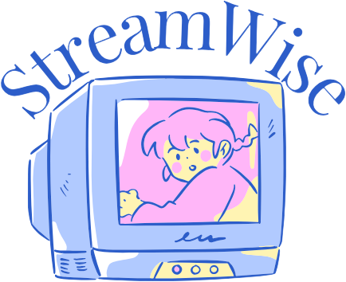

<p align="center"></p>

# StreamWise

[](https://github.com/LigiaZ/streamwise/actions/workflows/tests.yml)

**Is your streaming worth what you pay for it?**

Log what you watch, and StreamWise works out what each subscription really costs per hour, which ones are poor value, and which ones to pause until there's something new to watch.

- 🔎 **Search any film or series.** Runtime and where it streams in your country are filled in for you (via TMDB).
- 💶 **Cost per hour, per service.** Prices for the Netherlands are pre-filled and editable for anywhere else.
- ⏸️ **Pause suggestions.** Nothing watched in 30 days? It tells you, and what pausing would save over a year.
- 📅 **What's coming.** For series, it shows when the next episode or season arrives.
- 📱 **Install it like an app.** On iPhone: Share → *Add to Home Screen*.
- 🔒 **Private by design.** No accounts and no database. Your log stays in your browser.

## How it decides

| Verdict | Rule |
|---|---|
| **Great value** | under €1.00 per hour watched in the last 30 days |
| **Worth it** | under €2.50 per hour, cheaper than renting what you watched (≈ €4.99 per 2-hour film) |
| **Poor value** | above €2.50 per hour, so renting would have cost less |
| **Pause it** | nothing watched for 30+ days |
| **Too new to tell** | subscribed less than 14 days ago |

## Architecture

```
index.html, app.js, app.css     mobile-first web app (installable, no build step)
api/*.py                        Vercel Python serverless functions
streamwise/
  catalog.py                    services, brand colours, prices per country
  tmdb.py                       TMDB client: search, runtime, providers, next episode
  report.py                     cost-per-hour, verdicts, savings, monthly history
  web.py                        endpoint logic shared by Vercel and the dev server
tests/                          unit tests (no network needed)
dev.py                          local server that mirrors Vercel
```

The browser sends the log to `/api/report` only to compute the numbers. Nothing is stored server-side. The TMDB token lives in a server environment variable and never reaches the browser.

## Run it locally

```bash
cp .env.example .env.local      # paste your TMDB "API Read Access Token"
python3 dev.py                  # http://localhost:3000
python3 -m unittest discover tests
```

Python 3.9+ and no dependencies. Without a TMDB token, everything except title search still works: use *Add it manually* or *Try it with sample data*.

## Deploy

Import the repo in Vercel (no build settings needed) and add `TMDB_READ_TOKEN` under **Settings → Environment Variables**.

## Credits

Title data and where-to-watch from [TMDB](https://www.themoviedb.org/) and JustWatch. This product uses the TMDB API but is not endorsed or certified by TMDB. Illustration by Lígia Zanchet.

MIT licensed. Built by [Lígia Zanchet](https://www.zanchet.eu).
